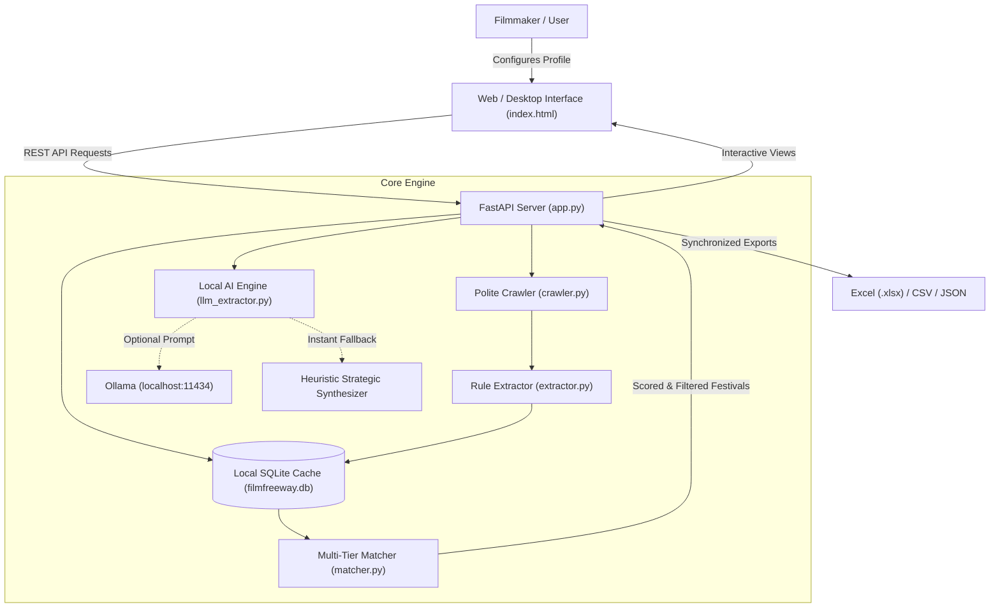

# 🎬 FilmFreeway DeepSearch Pro

[](https://www.python.org/)
[](https://fastapi.tiangolo.com/)
[](https://www.sqlite.org/)
[](https://ollama.com/)
[](LICENSE)
[](https://github.com/Vagabond404/FilmFreeway-DeepSearch-Pro/releases)
[](https://github.com/Vagabond404/FilmFreeway-DeepSearch-Pro/releases)

> **FilmFreeway DeepSearch Pro** is an open-source, local-first intelligence and strategic matching platform for independent filmmakers. It crawls, extracts, audits festival regulations, verifies complex multi-tier eligibility rules, and delivers AI-powered editorial briefings for your film submissions—without cloud lock-in or subscription fees.

Available as both a **standalone 1-click Windows desktop application (zero Python required)** and a **modern FastAPI developer stack**.

---

## 🌟 Key Capabilities

- **🎯 5-Tier Multi-Dimensional Matching Engine**: Compares your film against hundreds of festivals across runtime bounds, premiere status (World, International, National), AI usage policies, completion date cutoffs, student/debut eligibility, and genre focuses.
- **🛡️ Immediate Disqualification & Blocker Detection**: Instantly warns you if a festival prohibits AI tools, requires a premiere your film cannot grant, or rejects public online screeners, preventing wasted submission budgets.
- **🤖 Local AI Strategic Summaries (Ollama)**: Automatically synthesizes festival editorial lines, programmer expectations, and submission strategies using private, on-device LLMs (e.g., `qwen2.5:0.5b`, `llama3.2:1b`), with an instant heuristic analytical fallback if Ollama is offline.
- **📑 Comprehensive 5-Tab Festival Dossiers**:
  1. *AI Strategy & Overview*: Punchy 3-part intelligence brief on prestige, editorial expectations, and custom fit.
  2. *Categories & Eligibility*: Category-by-category verdict with exact acceptance reasons, student/debut discounts, and fee schedules.
  3. *Requirements & Rules*: Side-by-side compliance grid and full official festival regulations.
  4. *Awards & Prizes*: Trophies, cash prizes, distribution opportunities, and industry perks.
  5. *Dates, Venues & Screenings*: Milestone timelines, physical cinema venues, city, and country details.
- **⭐ Watchlist & Pipeline Tracker**: Save festivals, track submission status (*To Submit*, *In Progress*, *Submitted*, *Selected*, *Not Selected*), and store personal notes in persistent local SQLite storage.
- **📂 Analysis Session Archiving**: Save complete multi-festival analysis snapshots with custom memos and restore previous sessions in milliseconds without re-scraping.
- **📊 Precision Filtered Exports**: Export exactly what you see after applying real-time filters and sorting to styled **Excel (.xlsx)** workbooks, **CSV (.csv)** with UTF-8 BOM, or **JSON (.json)** schemas.
- **💻 True Native Windows Desktop Mode**: Launches in dedicated Chromium app mode with no address bar or browser tabs, dynamic port binding, and standalone execution.

---

## 🏗️ System Architecture

```
FilmFreeway-DeepSearch-Pro/
├── static/
│   └── index.html            # Single-page modern responsive UI (Tailwind CSS, Lucide)
├── app.py                    # FastAPI application server, REST API, export handlers
├── desktop.py                # Native Windows desktop application launcher & watchdog
├── matcher.py                # Multi-tier constraint validation & strategic scoring engine
├── extractor.py              # Robust HTML parsing, regex extraction & rule normalization
├── llm_extractor.py          # Local LLM integration (Ollama API) & heuristic fallback
├── crawler.py                # Rate-limited polite FilmFreeway web scraper (curl_cffi)
├── db.py                     # SQLite caching, migrations, watchlist & analysis sessions
├── profile.json              # Default film project configuration
├── build_app.py              # PyInstaller automated build pipeline
├── installer.iss             # Inno Setup Windows installer specification
├── requirements.txt          # Python dependencies
├── LICENSE                   # MIT License
└── README.md                 # Complete project documentation
```

### Data Flow Diagram



---

## 🚀 Quickstart

### Option 1: Standalone Windows App (Zero Python Required)

If you just want to run the software on Windows without installing Python, Git, or dependencies:

1. Download the latest `Setup_FilmFreeway_DeepSearch_v2.exe` from the [GitHub Releases](https://github.com/Vagabond404/FilmFreeway-DeepSearch-Pro/releases).
2. Run the installer (takes ~10 seconds, installs cleanly for the current user).
3. Double-click the **FilmFreeway DeepSearch Pro** shortcut on your Desktop.
4. The software starts instantly and opens in its dedicated desktop window.

---

### Option 2: Developer / Local Environment Setup

#### 1. Prerequisites
- **Python**: Version 3.10 or higher installed.
- **Git**: Installed on your system.
- *(Optional)* **Ollama**: For on-device LLM analysis summaries ([https://ollama.com](https://ollama.com)).

#### 2. Clone the Repository
```bash
git clone https://github.com/Vagabond404/FilmFreeway-DeepSearch-Pro.git
cd FilmFreeway-DeepSearch-Pro
```

#### 3. Create a Virtual Environment
```bash
# Windows
python -m venv venv
venv\Scripts\activate

# Linux / macOS
python3 -m venv venv
source venv/bin/activate
```

#### 4. Install Dependencies
```bash
pip install -r requirements.txt
```

#### 5. Run the Application
**As a Web Server:**
```bash
python app.py
```
Open your browser at [http://127.0.0.1:8000](http://127.0.0.1:8000).

**As a Native Desktop Window:**
```bash
python desktop.py
```

---

## 🤖 Local AI Setup (Ollama Integration)

FilmFreeway DeepSearch Pro runs completely offline. To enable dynamic AI-generated festival briefings:

1. Download and install **Ollama** from [ollama.com](https://ollama.com).
2. Pull a lightweight model suited for your CPU/RAM:
   ```bash
   # Ultra-lightweight (0.5B parameters, works on any CPU with <1GB RAM)
   ollama pull qwen2.5:0.5b

   # Recommended balance of intelligence and speed (1.5B)
   ollama pull qwen2.5:1.5b

   # Or Llama 3.2
   ollama pull llama3.2:1b
   ```
3. Ollama runs in the background on `http://localhost:11434`.
4. DeepSearch Pro automatically detects Ollama and switches the status indicator to **Local AI Active**.
5. *Note*: If Ollama is not installed or offline, the platform seamlessly uses its built-in rule-based intelligence synthesizer to generate detailed briefs in under 1 millisecond.

---

## 🎯 Matching Engine & Scoring Rubric

The strategic matcher calculates an overall score (0% to 100%) based on five pillars:

| Pillar | Weight | Factors Evaluated |
|---|---|---|
| **Critical Constraints (Blockers)** | Pass / Fail | Maximum runtime limits, AI prohibitions, public online availability restrictions, World/National premiere prerequisites, completion date cutoff years. Disqualified festivals receive an 8% score and clear red blocker tags. |
| **Artistic & Category Fit** | 30% | Overlap between project genres (`documentary`, `animation`, `drama`, `thriller`, etc.) and festival categories. |
| **Rules & Budget Adherence** | 25% | Submission fee vs. filmmaker's max budget ceiling. Free festivals ($0) receive full points. |
| **Deadlines & Timing** | 20% | Upcoming submission deadlines relative to the target cutoff date. |
| **Prestige & Trust Score** | 15% | Festival track record, years running, verified reviews, and official status. |
| **Strategic Bonuses** | Up to +15% | Academy Award® (Oscar) qualifying, BAFTA qualifying, Méliès d'Or status, Student category discounts, First-Time Filmmaker competitions, regional focus matching country of filming/origin. |

---

## 📡 REST API Reference

The FastAPI backend exposes the following core endpoints:

| Method | Endpoint | Description |
|---|---|---|
| `GET` | `/api/health` | Fast health probe (<1ms), returns server and app status |
| `GET` | `/api/profile` | Retrieves current film profile configuration |
| `POST` | `/api/profile` | Updates and persists film profile settings |
| `POST` | `/api/analyze` | Executes multi-criteria matching across cached festivals |
| `GET` | `/api/bookmarks` | Returns all saved festivals in the user's Watchlist |
| `POST` | `/api/bookmarks/{slug}` | Adds or updates a festival in the Watchlist with status and memo |
| `DELETE` | `/api/bookmarks/{slug}` | Removes a festival from the Watchlist |
| `GET` | `/api/analyses` | Lists archived analysis sessions |
| `POST` | `/api/analyses/save` | Archives current analysis session with a name and note |
| `GET` | `/api/analyses/{id}` | Restores a saved analysis session |
| `DELETE` | `/api/analyses/{id}` | Deletes an archived analysis session |
| `GET` | `/api/export/excel` | Generates a styled Excel workbook of currently filtered results |
| `GET` | `/api/export/csv` | Generates a UTF-8 BOM CSV export of currently filtered results |
| `GET` | `/api/export/json` | Exports filtered results and search metadata as JSON |
| `POST` | `/api/llm/summarize/{slug}` | Generates or regenerates an AI editorial brief via Ollama |

---

## 🛠️ Building the Standalone Executable & Installer

If you make modifications and wish to compile your own standalone Windows distribution:

```bash
# 1. Compile Python runtime, dependencies, and assets into dist/
python build_app.py

# 2. Compile Inno Setup Windows installer (requires Inno Setup 6)
"C:\Program Files (x86)\Inno Setup 6\ISCC.exe" installer.iss
```
This generates `Setup_FilmFreeway_DeepSearch_v2.exe` ready for distribution.

---

## 🤝 Contributing

Contributions are welcome! Please feel free to submit a Pull Request.

1. Fork the Project
2. Create your Feature Branch (`git checkout -b feature/AmazingFeature`)
3. Commit your Changes (`git commit -m 'Add AmazingFeature'`)
4. Push to the Branch (`git push origin feature/AmazingFeature`)
5. Open a Pull Request

---

## 📄 License

Distributed under the MIT License. See [LICENSE](LICENSE) for more information.

---

## 🎬 Author & Acknowledgements

Created with ❤️ by **[Vagabond404](https://github.com/Vagabond404)** for independent filmmakers, documentarians, and artists worldwide.
